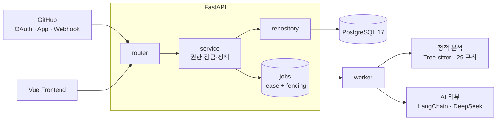
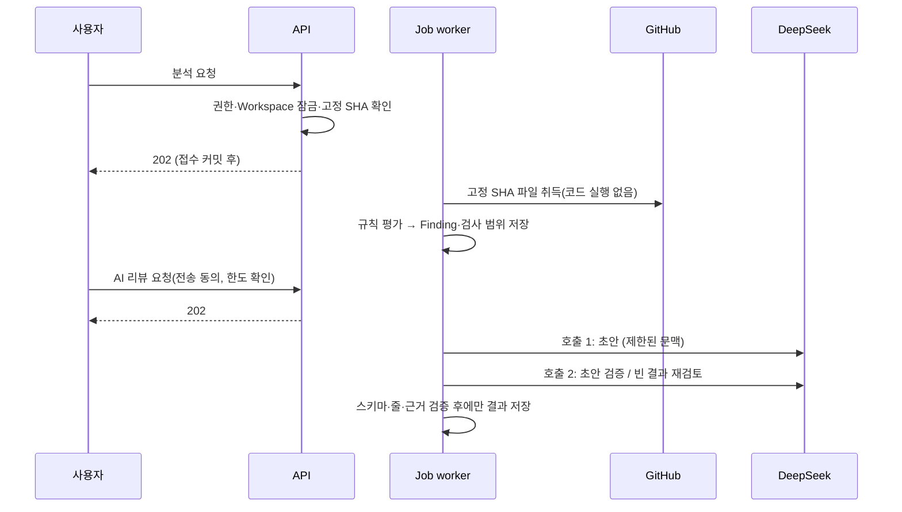

# PRism Backend

> GitHub Pull Request를 **고정 커밋 기준으로 정적 분석**하고, 사용자가 동의한 경우에만 **근거를 검증하는 AI 코드 리뷰**를 붙이는 팀용 리뷰 플랫폼의 API 서버입니다.

Python 3.12 · FastAPI · SQLAlchemy 2 · PostgreSQL 17 · Alembic · LangChain(DeepSeek) · Tree-sitter

| 저장소 | 역할 |
|---|---|
| **Prism-Backend** (이 저장소) | API·분석 엔진·AI 리뷰·백그라운드 Job |
| [Prism-Frontend](https://github.com/oso7865-ship-it/Prism-Frontend) | Vue 3 웹 클라이언트 |
| [Prism-Architecture](https://github.com/oso7865-ship-it/Prism-Architecture) | 설계 문서·ADR 40건·검증 도구·작업 기록 |

## 풀려는 문제

AI 코드 리뷰는 그럴듯하지만 **근거 없는 지적**이 섞이고, 같은 PR도 실행마다 결과가 달라집니다. PRism은 이를 두 가지로 나눠 다룹니다.

1. **정적 분석은 결정적**입니다. 고정한 commit SHA·규칙·설정 버전에 귀속된 결과를 만들고, 모르는 것은 추측하지 않고 `NOT_EVALUATED`·`PARTIAL`로 드러냅니다.
2. **AI는 설명자**입니다. 정적 판정을 바꾸지 않고, 모델 출력은 서버가 스키마·줄 번호·근거까지 검증하며, 두 번째 호출로 자기 초안을 다시 검토합니다. AI가 실패해도 정적 분석 결과는 그대로입니다.

## 아키텍처



**PR 하나가 결과가 되기까지**



```text
app/
  domain/    업무 소유자: auth user workspace repository pull_request analysis review standards webhook
  shared/    도메인 중립 기술: config database jobs security github observability exception
  workflows/ 도메인을 가로지르는 흐름(저장소 연결 등)
```

도메인은 서로의 ORM·Repository를 직접 쓰지 않고 공개 `api.py` 계약으로만 호출합니다. 이 경계는 문서가 아니라 테스트와 `architecture.json`으로 점검합니다.

## 설계 판단과 이유

| 판단 | 이유 |
|---|---|
| **물리 FK 없이 논리 참조 + Workspace 단위 직렬화** | 멀티테넌트 경계를 DB 제약이 아닌 서비스 규칙으로 일관되게 검증하고, 쓰기는 Workspace 행 잠금 아래 짧은 트랜잭션으로 직렬화합니다. 대신 모든 쓰기 경로가 같은 프로토콜을 지켜야 하므로 [무결성 규칙](https://github.com/oso7865-ship-it/Prism-Architecture/blob/main/docs/architecture/contracts/schema/README.md)과 동시성 테스트로 보완합니다. |
| **영속 Job + lease 세대(fencing)** | 접수 트랜잭션 커밋 후에만 `202`를 반환하고, 오래된 worker가 늦게 저장하는 것을 lease 세대로 막습니다. 재시도는 중복 실행될 수 있으므로 저장을 멱등하게 만들었습니다. |
| **분석 대상 코드를 실행·설치하지 않음** | 저장소 코드·PR 본문은 신뢰하지 않는 데이터입니다. 원문·diff·prompt를 DB/로그/Job에 남기지 않고, 외부 전송은 요청마다 소유자 동의를 받습니다. |
| **검증된 AI 결과만 저장** | strict 스키마, 전송한 파일·줄만 참조 허용, `SUPPORTED`/`NEEDS_CONTEXT` 분류, 초안→검증→빈 결과 재검토. 검증 장애를 "정상 0건"으로 바꾸지 않고 `FAILED`로 남깁니다. |
| **비용·남용 상한을 코드로 고정** | 요청당 외부 호출 최대 2회, 팀당 UTC 하루 30회·동시 1개, 실패·취소도 한도 소비. 호출 직전 권한·취소·연결 세대·lease 재확인. |
| **팀 문서 검색은 임베딩 없이 어휘(BM25) 기반** | 필수 섹션 보호 + 예산 내 선택으로 결정적이고 재현 가능하게 유지합니다. 한국어 문서와 영문 코드 간 어휘 불일치는 알려진 한계로 문서화했습니다. |

모든 결정은 [ADR](https://github.com/oso7865-ship-it/Prism-Architecture/tree/main/docs/architecture/adr)(영역별 40건, 대체 관계 추적)에 배경과 대안이 남아 있습니다.

## 기능

- **인증·팀**: GitHub OAuth 로그인, Access(메모리)·Refresh(HttpOnly 쿠키, 회전·재사용 탐지) 세션, 팀·초대·역할(OWNER/ADMIN/MEMBER).
- **저장소 연결**: GitHub App 설치에서 허용된 저장소를 불러와 **체크한 것만** 연결(후보 목록은 15분 임시 보관, 사용자·설치 토큰 미저장). Webhook으로 PR 자동 동기화, 설치 철회 시 접근 차단.
- **정적 분석**: Java·JavaScript·TypeScript·Python **29개 활성 규칙**(`static-1.1.0`). 파일별 평가 범위와 Finding을 commit SHA에 고정해 저장.
- **AI 리뷰**: 목적별(코드 / 보안 / 팀 문서 기준), 설명 모드별(시니어 / 주니어) 리뷰. 근거 줄·발생 조건·결과·미확인 전제를 구조화해 반환하고 개인별 처리 상태(확인·예정·의도·오탐)를 기록.
- **팀 문서 기준 리뷰**: 컨벤션·구조 문서를 버전 관리하고 섹션 단위로 검색해 인용 가능한 근거로 연결.

## 검증

CI는 푸시마다 아래를 모두 통과해야 하며, main에서만 이미지 게시·배포가 실행됩니다.

```text
ruff check · ruff format --check · mypy app
alembic upgrade head → downgrade base → upgrade head → alembic check   (PostgreSQL 17, 마이그레이션 왕복·드리프트)
pytest (통합 테스트 포함: 제약조건·동시 쓰기·트랜잭션 rollback)
컨테이너 smoke · 배포 스크립트 단위 테스트 · 공개 이미지 익명 pull 확인
```

최근 기록: **pytest 619 passed**, Ruff·format·mypy 통과, 마이그레이션 11개, 업무 테이블 20개. 테스트 DB가 없어 skip된 통합 테스트는 통과로 세지 않습니다.

## 배포

GitHub Actions → 테스트 통과한 이미지를 GHCR에 게시 → EC2에서 migration 사전 점검·적용 후 컨테이너 교체 → 내부/공개 ready 확인. 호스트 Caddy가 HTTPS를 종단하며 컨테이너는 비루트·읽기 전용 파일시스템·권한 제거로 실행합니다. 자동 DB downgrade는 하지 않고 호환이 확인된 이전 이미지로만 복귀합니다.

## 로컬 실행

필요: Git, [uv](https://docs.astral.sh/uv/), Docker(PostgreSQL 17용).

```bash
git clone https://github.com/oso7865-ship-it/Prism-Backend.git && cd Prism-Backend
cp config/development.example .env        # 로컬 개발 전용 값
docker compose up -d --wait               # PostgreSQL 17
uv sync --locked
uv run alembic upgrade head
uv run uvicorn app.main:create_app --factory --loop app.shared.database.event_loop:loop_factory --reload --no-access-log
```

`/health/live`는 항상 200, `/health/ready`는 DB 연결 실패 시 503(내부 오류는 노출하지 않음)입니다. GitHub 로그인·App 연동·AI는 `.env`에 자격증명을 설정해야 켜지며, 기본값은 모두 꺼져 있습니다. API 시작 시 migration을 자동 실행하지 않습니다.

```bash
uv run pytest -q -m "not integration"      # 단위 테스트
TEST_DATABASE_URL=...  uv run pytest -q -m integration   # 이름이 _test로 끝나는 별도 DB
```

## 알려진 한계

- **AI 리뷰 품질은 합성 평가셋 기준으로만 검증**했습니다. 독립 사람 검수와 범용 의미·수정안 품질은 미완료이며, 서버 검증은 형식·위치·권한 가드레일이지 자연어 주장의 진실성 증명이 아닙니다.
- 정적 분석은 Tree-sitter 구문 수준입니다. 타입 추론·전체 호출 그래프·동적 호출은 보장하지 않습니다.
- 허용 저장소가 300개를 넘으면 연결 후보 일부만 보입니다(화면에 안내).
- 공개 사용자 대상 서비스가 아니라 본인 조직·개인 프로젝트에서 쓰는 단계입니다.

## 더 읽기

[설계 문서 지도](https://github.com/oso7865-ship-it/Prism-Architecture/blob/main/docs/architecture/INDEX.md) · [Review 계약](https://github.com/oso7865-ship-it/Prism-Architecture/blob/main/docs/architecture/domain/review/README.md) · [DB 스키마](https://github.com/oso7865-ship-it/Prism-Architecture/blob/main/docs/architecture/contracts/schema/README.md) · [배포 설계](https://github.com/oso7865-ship-it/Prism-Architecture/blob/main/docs/architecture/operations/DEPLOYMENT.md)
